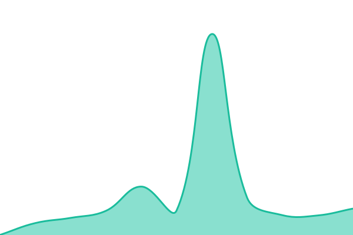
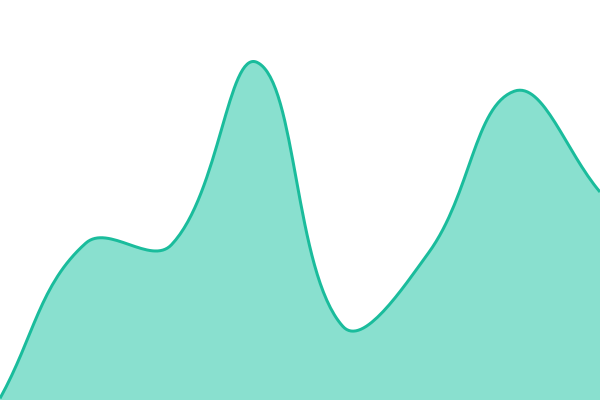
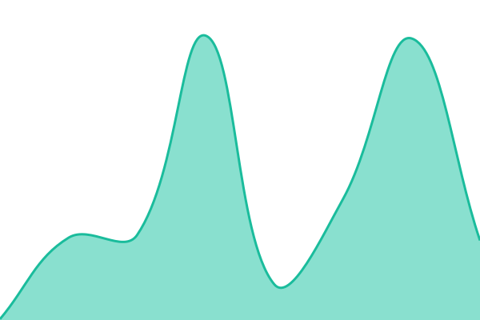
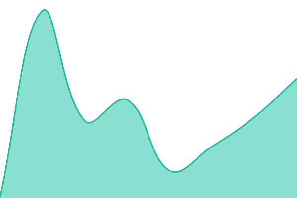
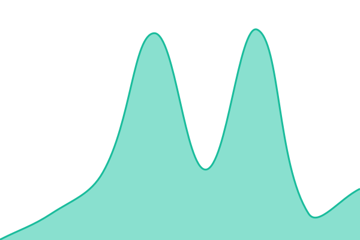
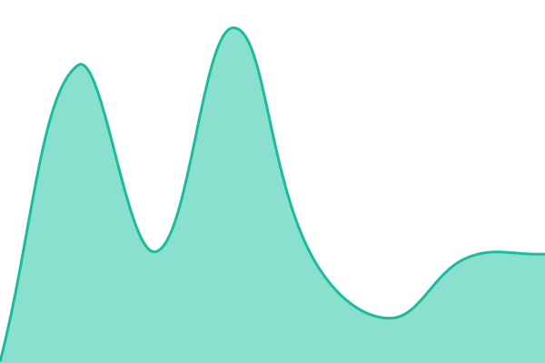
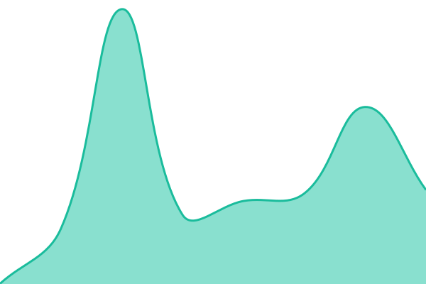

# [📈 Live Status](https://vevetron.github.io/upptime): <!--live status--> **🟩 All systems operational**

This repository contains the open-source uptime monitor and status page for [V](https://vevetron.github.io/upptime), powered by [Upptime](https://github.com/upptime/upptime).

With [Upptime](https://upptime.js.org), you can get your own unlimited and free uptime monitor and status page, powered entirely by a GitHub repository. We use [Issues](https://github.com/vevetron/upptime/issues) as incident reports, [Actions](https://github.com/vevetron/upptime/actions) as uptime monitors, and [Pages](https://vevetron.github.io/upptime) for the status page.

<!--start: status pages-->
<!-- This summary is generated by Upptime (https://github.com/upptime/upptime) -->
<!-- Do not edit this manually, your changes will be overwritten -->
<!-- prettier-ignore -->
| URL | Status | History | Response Time | Uptime |
| --- | ------ | ------- | ------------- | ------ |
|  [Metabase](https://metabase.dds.dot.ca.gov) | 🟩 Up | [metabase.yml](https://github.com/vevetron/upptime/commits/HEAD/history/metabase.yml) | 

 164ms
     
 | 

<a href="https://vevetron.github.io/upptime/history/metabase">100.00%</a>
    

|  [Metabase Staging](https://metabase-staging.dds.dot.ca.gov) | 🟩 Up | [metabase-staging.yml](https://github.com/vevetron/upptime/commits/HEAD/history/metabase-staging.yml) | 

 162ms
     
 | 

<a href="https://vevetron.github.io/upptime/history/metabase-staging">100.00%</a>
    

|  [Analysis](https://analysis.dds.dot.ca.gov) | 🟩 Up | [analysis.yml](https://github.com/vevetron/upptime/commits/HEAD/history/analysis.yml) | 

 75ms
     
 | 

<a href="https://vevetron.github.io/upptime/history/analysis">100.00%</a>
    

|  [Analysis Staging](https://analysis-staging.dds.dot.ca.gov) | 🟩 Up | [analysis-staging.yml](https://github.com/vevetron/upptime/commits/HEAD/history/analysis-staging.yml) | 

 80ms
     
 | 

<a href="https://vevetron.github.io/upptime/history/analysis-staging">100.00%</a>
    

|  [Reports](https://reports.dds.dot.ca.gov) | 🟩 Up | [reports.yml](https://github.com/vevetron/upptime/commits/HEAD/history/reports.yml) | 

 93ms
     
 | 

<a href="https://vevetron.github.io/upptime/history/reports">100.00%</a>
    

|  [Reports Staging](https://reports-staging.dds.dot.ca.gov) | 🟩 Up | [reports-staging.yml](https://github.com/vevetron/upptime/commits/HEAD/history/reports-staging.yml) | 

 85ms
     
 | 

<a href="https://vevetron.github.io/upptime/history/reports-staging">100.00%</a>
    

|  [dbt Docs](https://dbt-docs.dds.dot.ca.gov) | 🟩 Up | [dbt-docs.yml](https://github.com/vevetron/upptime/commits/HEAD/history/dbt-docs.yml) | 

 151ms
     
 | 

<a href="https://vevetron.github.io/upptime/history/dbt-docs">100.00%</a>
    

|  [dbt Docs Staging](https://dbt-docs-staging.dds.dot.ca.gov) | 🟩 Up | [dbt-docs-staging.yml](https://github.com/vevetron/upptime/commits/HEAD/history/dbt-docs-staging.yml) | 

 159ms
     
 | 

<a href="https://vevetron.github.io/upptime/history/dbt-docs-staging">100.00%</a>
    

|  [GTFS](https://gtfs.dds.dot.ca.gov) | 🟩 Up | [gtfs.yml](https://github.com/vevetron/upptime/commits/HEAD/history/gtfs.yml) | 

 65ms
     
 | 

<a href="https://vevetron.github.io/upptime/history/gtfs">100.00%</a>
    

|  [Cal-ITP](https://www.calitp.org) | 🟩 Up | [cal-itp.yml](https://github.com/vevetron/upptime/commits/HEAD/history/cal-itp.yml) | 

 236ms
     
 | 

<a href="https://vevetron.github.io/upptime/history/cal-itp">100.00%</a>
    

<!--end: status pages-->

[**Visit our status website →**](https://vevetron.github.io/upptime)

## 📄 License

- Powered by: [Upptime](https://github.com/upptime/upptime)
- Code: [MIT](./LICENSE) © [Anand Chowdhary](https://anandchowdhary.com), supported by [Pabio](https://pabio.com)
- Data in the `./history` directory: [Open Database License](https://opendatacommons.org/licenses/odbl/1-0/)
